# PM2.5 Data Analytic Pipeline

## Project Overview
โปรเจคนี้เป็นส่วนหนึ่งของรายวิชา DS525 DataWareHouse Master degree in Data Science SWU โดยมุ่งหวังศึกษาการสร้าง Data Pipeline โดยใช้ Model Data Stack ชนิดต่างๆในการสร้าง Data Pipeline แบบ End-to-End โดยคาดหวังว่าจะสามารถสร้าง Data Pipeline แบบ Autonomic ตั้งแต่เริ่มต้นกระบวนการไปจนถึงการสร้าง Dashboard ข้อมูลที่ใช้ในการศึกษาครั้งนี้เป็นชุดข้อมูลเปิดเกี่ยวกับค่าฝุ่น PM2.5 แบบรายชั่วโมง จัดทำขึ้นโดย สำนักงานคณะกรรมการดิจิทัลเพื่อเศรษฐกิจและสังคมแห่งชาติ ในรูปแบบ CSV
## Problem Statement

ในปัจจุบันฝุ่น PM2.5 หรือฝุ่นที่มีขนาดเล็กมากกว่า 2.5 ไมครอน มีเพิ่มมากขึ้นทุกปีและมีแนวโน้มจะมีความรุนแรงมากขึ้น จนกลายเป็นปัญหาสุขภาพที่สำคัญประเทศไทย เนื่องจากเป็นปัจจัยเสี่ยงและสาเหตุสำคัญที่ทำให้เกิดมะเร็งปอด และโรคระบบทางเดินหายใจอื่น ๆ เช่น หอบหืด ถุงลมโป่งพอง เป็นต้น นอกจากนี้ยังมีการถกเถียงอย่างกว้างขวางว่า ค่าฝุ่น PM2.5 ในประเทศไทยนั้นอยู่ในระดับอันตรายจริงหรือไม่ งานวิจัยของคณะแพทยศาสตร์ มช. ที่ได้ทำการศึกษาผู้ที่เสียชีวิตในจังหวัดเชียงใหม่ที่สัมพันธ์กับระดับ PM2.5 พบว่าทุก ๆ 10 ไมโครกรัม/ลบ.เมตรที่เพิ่มขึ้นของค่าเฉลี่ย PM2.5 รายวัน จะสัมพันธ์กับการเสียชีวิตเพิ่มขึ้นของประชากรเชียงใหม่ 1.6% ในอีก 6 วันต่อมา จากปัจจัยดังกล่าวผู้จัดทำเล็งเห็นถึงความสำคัญของปัญหาค่าฝุ่น PM 2.5 ที่มีปริมาณสูง จึงเป็นแรงบันดาลใจในการจัดทำโปรเจคนี้ขึ้น เพื่อสามารถทราบผลและติดตามค่าฝุ่น PM2.5 ที่เป็นปัจจุบันในประเทศไทย และเปรียบเทียบกับเกณฑ์มาตรฐานองค์การอนามัยโลก (WHO) ดังนั้นจะทำให้ทราบว่าพื้นที่จังหวัดไหนที่มีค่าฝุ่นสูง เราจะได้เตรียมตัวรับมือ ป้องกัน และลดปริมาณฝุ่นลง ด้วยการแจ้งเตือนคนในพื้นที่อย่างเร่งด่วน และล่วงหน้า พร้อมทั้งการสำรวจพื้นที่เพื่อติดตั้งสถานีเพิ่มเติมต่อไป และยังสามารถประสานงานกับหน่วยงานที่เกี่ยวข้อง เช่น ทำฝนเทียม ติดตั้งเครื่องพ่นไอน้ำ ลดการเผาทุกชนิด ออกมาตรการ worf from home เพื่อช่วยลดการใช้รถส่วนบุคคลเพื่อลดควันดำ ช่วยกันปลูกต้นไม้ให้มากขึ้น เป็นต้น เพื่อลดปริมาณฝุ่น PM2.5

## Objectives of the study
1. สร้าง End-to-End Data Pipeline เพื่อดึงข้อมูลค่าฝุ่น PW2.5 มาแสดงใน Dashboard พร้อมเปรียบเทียบค่าฝุ่นกับคำแนะนำระดับค่าฝุ่นที่ปลอดภัยขององค์การอนามัยโลก(WHO)
2. จัดอัดดับบริเวณที่มีค่าฝุ่น PM2.5 สูงที่สุด หรือเกินเกณฑ์ที่ WHO กำหนด เพื่อติดตามเฝ้าระวังปัญหาสุขภาพในพื้นที่นั้นๆ  

## Tech Stacks & Architecture work flow
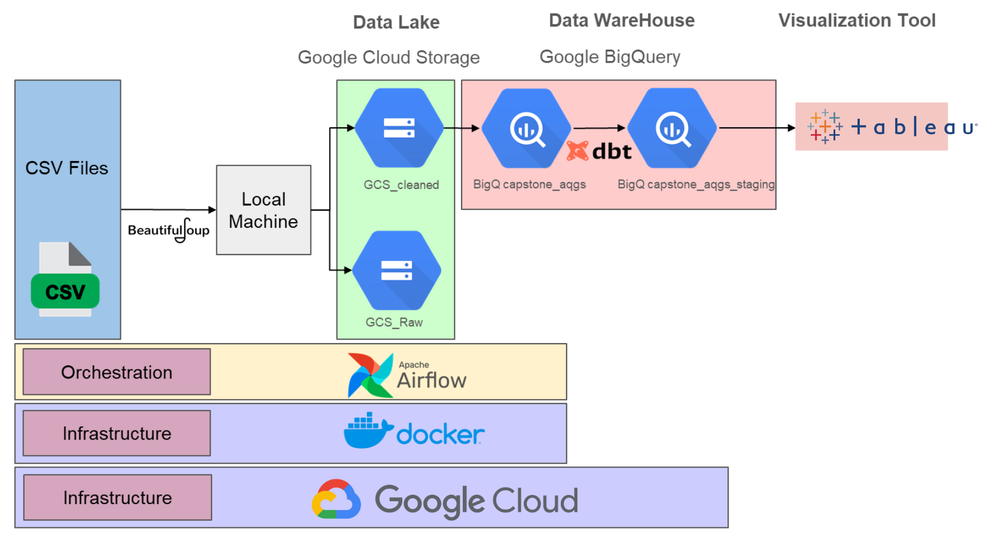

### Data Source
การศึกษาในครั้งนี้ ใช้ชุดข้อมูลเปิดซึ่งเก็บข้อมูลค่าฝุ่น PM2.5 จากสถานีเก็บข้อมูลจำนวน 163 สถานี ซึ่งกระจายอยู่ใน 73 จังหวัดทั่วประเทศไทย โดยข้อมูลอยู่ในรูปของ CSV File 1 ชั่วโมงต่อ 1 File โดยจะอัพโหลดข้อมูลขึ้นเว็บไซต์ทุกๆ 1 ชั่วโมง และจำกัดจำนวน File ที่แสดงในเว็บไซต์ที่ 24 ไฟล์ [Link ข้อมูล](https://www.facebook.com/borntodev)


### Orchestration (Airflow)
ในการศึกษาครั้งนี้เลือกใช้ Apache Airflow ในการทำ Orchestration เนื่องจากเป็น Open Source และเริ่มต้นใช้งานได้ง่ายไม่ยุ่งยาก โดยในการศึกษาครั้งนี้จะทำการติดตั้ง Airflow โดยใช้ Docker ในการติดตั้งเพื่อให้สะดวกต่อการใช้งานและการตั้งค่า [Document For Running Airflow in Docker](https://airflow.apache.org/docs/apache-airflow/stable/howto/docker-compose/index.html)

### Data Lake (GCS)
ในการศึกษาครั้งนี้ ใช้ Google Cloud Storage ในการสร้าง Data Lake เนื่องจากใช้งานง่าย สะดวกมีการสร้างคำสั่งของการใช้งาน Google Cloud Storage ร่วมกับการสร้าง DAG ของ Airflow เอาไว้แล้ว [Google Cloud Operators with Airflow](https://airflow.apache.org/docs/apache-airflow-providers-google/stable/operators/cloud/index.html) นอกจากนี้เหตุผลสำคัญอีกประการคือ Google Cloud Offer Free trial Account เพื่อใช้ในการศึกษา [Google Free Trial](https://cloud.google.com/free/?utm_source=google&utm_medium=cpc&utm_campaign=japac-TH-all-en-dr-BKWS-all-core-trial-PHR-dr-1605216&utm_content=text-ad-none-none-DEV_c-CRE_667107444154-ADGP_Hybrid+%7C+BKWS+-+BRO+%7C+Txt+-GCP-General-google+cloud+platform-main-KWID_43700077631831033-kwd-361600142637&userloc_1012728-network_g&utm_term=KW_cloud%20google%20platform&gad_source=1&gclid=EAIaIQobChMI6saLtPn8hQMVMKRmAh0LvgmKEAAYASAAEgIsc_D_BwE&gclsrc=aw.ds)

โดยใน Data Lake จะถูกแบ่งออกเป็นส่องส่วนคือ
1. Raw Files Storage เป็นส่วนที่ใช้สำหรับจัดเก็บ File ดิบซึ่งยังไม่ผ่านการทำความสะอาด โดยจะแยกเก็บเป็นรายชั่วโมง 1 ชั่วโมงต่อ 1 File สาเหตุที่สร้างที่เก็บ Raw File เนื่องจากว่าในอนาคตหากเกิดการเสียหายของข้อมูล หรือต้องการข้อมูลดิบเพื่อไปใช้ประโยชน์อื่นๆ สามารถเรียกใช้ได้อย่างทันทีไม่ต้องเสียเวลาและทรัพยากรในการเก็ฐข้อมูลใหม่
2. Cleaned Files Storage เป็นส่วนที่นำ Raw ทั้งหมดมาทำความสะอาดและจัดรูปแบบใหม่ให้อยู่ในรูปที่พร้อมใช้งาน และพร้อมนำไปประบวนผลและใช้ประโยชน์ต่อไป

การทำงานของ Data Lake ในส่วนนี้ Airflow จะทำหน้าที่ Run Python Scripts เพื่อดึงข้อมูลจากหน้าเว็บไซต์ทุกๆ 1 ชั่วโมง โมาเก็บใน Local Machine หลังจากนั้นทำการอัพโหลด Raw File ที่ยังไม่ผ่านการทำความสะอาดเข้าไปเก็บไว้บน Data Lake ในส่วนที่ 1 ในขณะเดียวกันก็จะทำการทำความสะอาดข้อมูลทั้งหมดที่ดึงมาได้ และเตรียมให้พร้อมก่อนที่จะนำไปเก็บไว้บน Data Lake ในส่วนที่สองซึ่งเก็ฐ Cleaned Files
### Data WareHouse (BigQuery)
ในการศึกษาครั้งนี้ เลือกใช้ Data WareHouse ของ Google Cloud คือ Google BigQuery เนื่องจากสามารถเชื่อต่อกับ GOogle Cloud Storage (GCS) ได้อย่างมีประสิทธิภาพ การเชื่อมต่อทำได้ง่าย ร่วมถึงในชีวิตจริงหากใช้ Cloud เจ้าใดเจ้าหนึ่งน่าจะสามารถช่วยประหยัดค่าใช้จ่ายในการใช้งาน Cloud ได้ดีกว่าการดึงข้อมูล ข้าม Cloud ไปมาเพื่อใช้งาน

### Data Transformation (dbt)
ในการศึกษาครั้งนี้เลือกใช้ Data Build Tool(dbt) ในการทำ Data Transform ใน Data wareHouse เนื่องจากมีข้อดีในการสามารถเก็บ SQL Script เอาไว้ใช้ได้ และสามารถจัดการ Data ได้ด้วยการสั่งคำสั่งเพียงครั้งเดียว นอกจากนี้ยังเป็น Open-source ทำให้ไม่มีปัญหาเรื่องค่าใช้จ่ายเมื่อเรียกใช้งาน 

### Data Visualization (Tableau)
ในการศึกษาครั้งนี้เลือกใช้ Tableau ในการทำ Visualization สาเหตุที่เลือกใช้ Airflow ในการเนื่องจาก
1. เป็นเครื่องมือทำ Visualiztion ที่มี Native Connection ให้เลือกใช้งานหลายชนิด กล่าวคือไม่ต้องอาศัยการเชื่อมต่อผ่าน odbc หรือ jdbc ทำให้สามารถเชื่อมต่อและดึงข้อมูลมาใช้ได้อย่างรวดเร็ว
2. มีความชำนาญในการใช้เครื่อง Tableau มากกว่าการใช้ Visualization อื่นๆ ซึ่งเป็นเหตุผลที่ค่อนข้างสำคัญเนื่องจากไม่ว่าเครื่องมือที่ใช้จะสามารถใช้งานได้ดีแค่ไหน แต่หากขาดความรู้ความชำนาญในการใช้งานย่อมไม่สามารถดึงประสิทธิภาพของเครื่องมือออกมาได้ถึงจุดสูงสุด 
3. เป็นเครื่องมือที่ใช้งานได้ค่อนข้างง่ายและมี Community ที่ค่อนข้างแข็งแรงสามารถค้นหาข้อมูล หรือข้อผิดพลาดที่เกิดขึ้นได้ง่าย นอกจากนี้ยังสามารถแสดงผลผ่าน Tableau Public ได้ในกรณีที่เป็น Open data

อย่างไรก็ตาม ยังต้องคำนึกถึงค่าใช้จ่ายที่เกิดขึ้น แต่ในงานชิ้นนี้ทางผู้จัดทำใช้ Student License ทำให้ประหยัดค่าใช้จ่ายในส่วนของการใช้ Tableau ไปได้

document link : https://docs.google.com/document/d/1B8q8OuI_c4hDm29qRhvuDbqT8aP9DcEsRC9KpnumfEI/edit

##

# Instruction

## Capstone Project มีการใช้ Google Cloud Platform (GCP) ดังนี้
- Cloud Storage : ต้องสร้าง bucket เตรียมไว้ก่อน
- BigQuery : ไม่ต้อง dataset เตรียมไว้ เพราะจะสร้างจาก etl.py ใน dags ผ่าน Airflow
- Private key : ต้องสร้างเตรียมไว้ เพื่อใช้ในการ connection กับ Cloud Storage และ BigQeury 


### 0. ต้องมี Google Account ก่อน เพื่อทำการสร้าง Project บน GCP


### 1. สร้าง Project บน GCP
- เข้าใช้งาน GCP โดย Cloud Console และเลือก Select a project

    

- จะมีหน้าต่างใหม่ กด NEW PROJECT

    
 
- กรอกข้อมูล กดปุ่ม CREATE 

    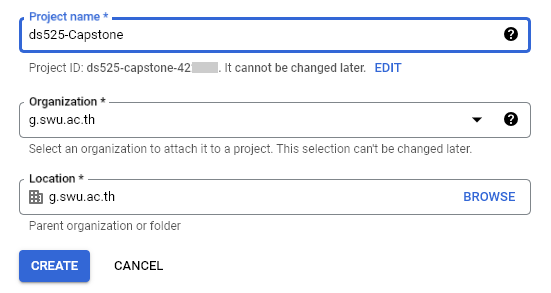

- สร้าง Project เสร็จเรียบร้อย จะใช้ข้อมูลจาก Project ID สำหรับ Capstone Project นี้

    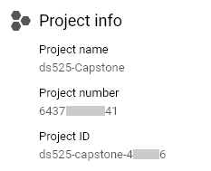


### 2. สร้าง Bucket บน Cloud Storage
- ไปที่ Cloud Storage -> Bucket

    

- กด + CREATE

    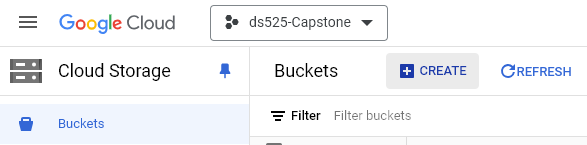

- กรอกข้อมูลและกดปุ่ม CONTINUE ทีละขั้นตอน โดยกรอกข้อมูลตามรูปด้านล่างนี้ และกดปุ่ม CREATE

    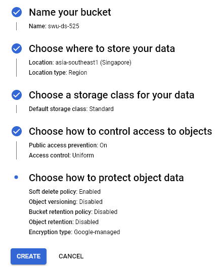


### 3. สร้าง Private key file
- ไปที่ IAM & Admin -> Service Accounts

    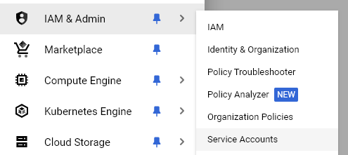

- กด + CREATE SERVICE ACCOUNT

    

- ส่วนของ 1. Service account details กรอก Service account name เป็นอะไรก็ได้ และกดปุ่ม CREATE AND CONTINUE
- ส่วนของ 2. Grant this service account access to project ให้สร้าง role ตามรูปด้านล่างนี้ และกดปุ่ม CONTINUE
- ส่วนของ 3. Grant users access to this service account ไม่ต้องใส่อะไร และกดปุ่ม DONE

    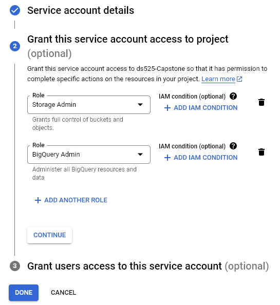

- สร้างเรียบร้อยแล้ว เข้า Service accounts ที่สร้างไว้ ไปที่ Tab : KEYS

    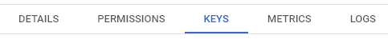

- กด ADD KEY -> Create new key

    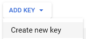

- หน้าต่าง Create private key ส่วน Key type : JSON และกด CREATE

    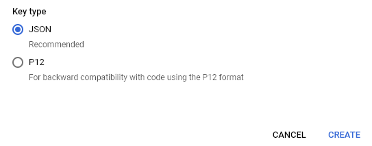

- Private key file จะถูก download ให้เก็บ file นั้นไว้ เพื่อใช้ใน Capstone Project ต่อไป

##
## Capstone Project

### 1. เตรียมการเพื่อสร้าง Data pipeline บน Airflow

- สร้าง folder ชื่อ 08-capstone-project เพื่อให้ทุก file และทุก folder อยู่ภายใน folder นี้
- สร้าง folder ชื่อ key ในนั้น เพื่อเก็บ Private key file (JSON) ที่ได้จากขั้นตอนการสร้าง Private key file โดยการลาก file ใส่ใน folder

    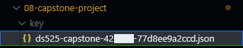


- เข้าไปใน folder ชื่อ 08-capstone-project เพื่อสร้าง project โดย run คำสั่ง
```sh
cd 08-capstone-project
```

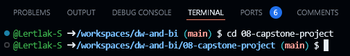

- สร้าง environment สำหรับการทำ project python โดย run คำสั่ง

```sh
python -m venv ENV
```
- activate เข้าไปใน ENV เพื่อเก็บ package ที่ใช้งานใน project โดย run คำสั่ง
```sh
source ENV/bin/activate
```
* จะเกิด folder ชื่อ ENV

    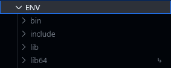


- เชื่อมต่อกับ Apache Airflow โดยเริ่มจากการ run คำสั่ง
```sh
docker compose up
```

- และไปที่ Tab : PORTS ที่ port: 8080 (ที่ลูกโลก)

    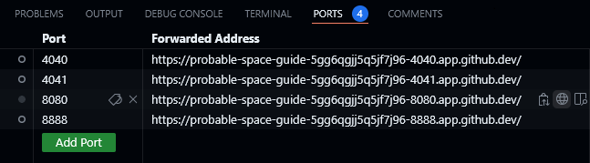

- ดู Username และ Password จากไฟล์ docker-compose.yaml (environment) ที่ใช้ในการ Sign In เข้า Airflow

    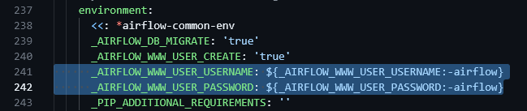

    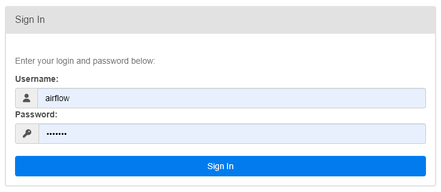

- สร้าง connection เพื่อติดต่อกับ GCP บน Airflow โดยไปที่ Tab : Admin -> Connection แล้วกด ปุ่ม + Add a new record

    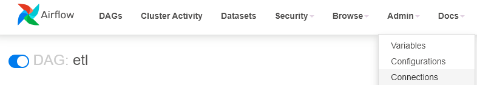

    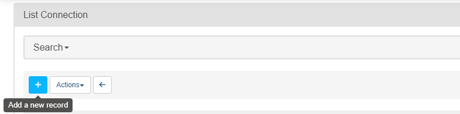

- ใส่ข้อมูลดังนี้

    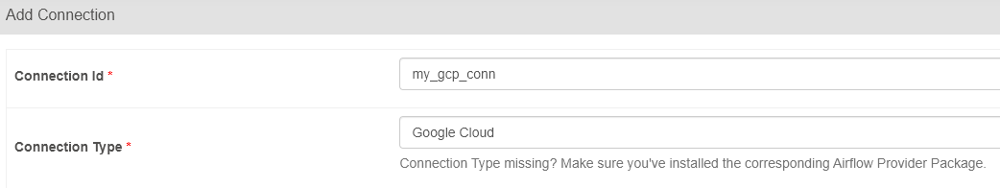

- โดยในส่วนของ Keyfile JSON มีวิธีการใส่ข้อมูล คือ เปิดไฟล์ JSON ใน folder : Key 

    

- แล้วกด Ctrl+A (เพื่อเลือกข้อมูลทั้งหมด) แล้วกด Ctrl+C (เพื่อ Copy) 
    
    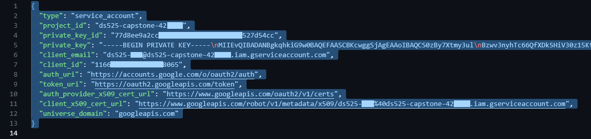

- แล้วไปที่ช่องของ Keyfile JSON กด Ctrl+P (เพื่อวางข้อมูลที่ copy มาจากไฟล์) แล้วกดปุ่ม Save

    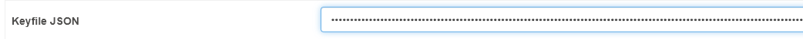

    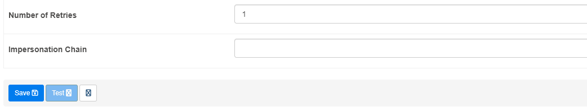

##

### 2. ขั้นตอนการทำงาน automate จาก etl.py ที่อยู่ใน folder : dags ที่เชื่อมต่อกับ Airflow มีดังนี้

- ทำการ load file CSV จากหน้า Web: https://opendata.onde.go.th/dataset/14-pm-25 ทุกชั่วโมงแล้ว save file ที่ folder: data
- ทำการ transform ข้อมูลจากทุก file มารวมอยู่ใน file: all_data.csv ที่อยู่ใน folder: data/cleaned
- โดยมีเพิ่ม field: provice ที่แยกจาก field: area_en และเพิ่ม field: datetime จาก field: date และ time รวมกัน

    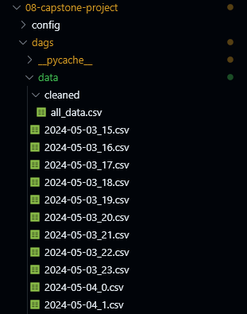

##

- ทำการ load file ทั้งหมดขึ้น Bucket: swu-ds-525 บน Google Cloud Storage ที่สร้างเตรียมไว้ก่อนหน้านี้
- โดยแบ่งข้อมูลแยกออกเป็น folder ใน Bucket คือ pm25_raw: เก็บ file ที่ได้จาก Web และ pm25_cleaned: เก็บ file all_data.csv

    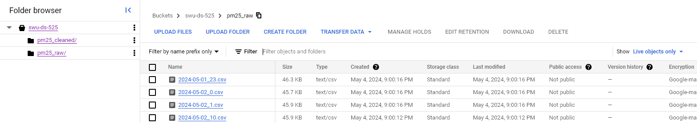

    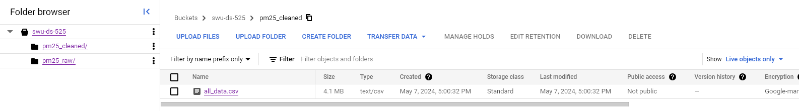

##

- ทำการนำข้อมูลจาก file: all_data.csv เข้า dataset: capstone_aqgs บน BigQuery
- สร้าง table: who_guidline และใส่ข้อมูล ค่ามาตรฐานของอากาศจากองค์การอนามัยโลก (WHO) สำหรับใช้ข้อมูลทำ visualization ต่อไป
- โดยมีการ transform แยกข้อมูลออกเป็น 2 tables, ที่ table: pm25_trans ทำการเพิ่ม field: pollutant และทำ partition ดังนี้

    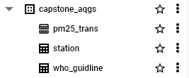

- โดยมี Data modeling ดังนี้

    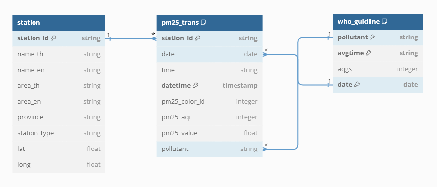

- เมื่อ Airflow ทำงานได้ complete ตาม schedule ที่กำหนดไว้

    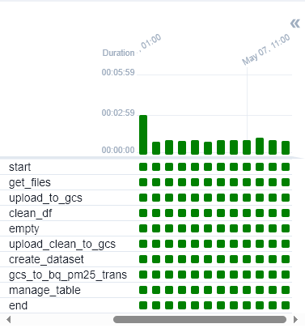

    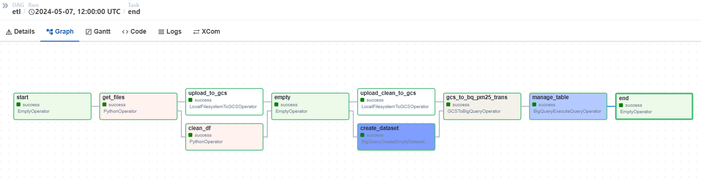


##

### 3. สร้าง view ที่ dataset: capstone_aqgs_staging บน BigQuery โดย dbt

- Download library dbt-core dbt-bigquery เพื่อให้สามารถใช้งาน dbt และเชื่อมต่อกับ BigQuery ได้ โดย run คำสั่ง
```sh
pip install dbt-core dbt-bigquery
```

- สร้าง project profile dbt โดย run คำสั่ง
```sh
dbt init
```
- และมีการกรอกข้อมูลตามรูปด้านล่าง

    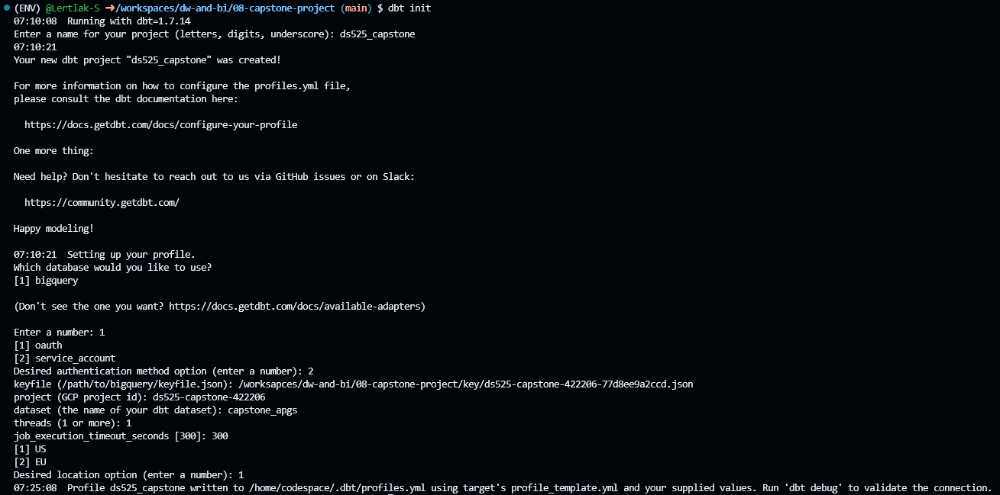


- สร้าง file: profiles.yml ใน folder: ds525_capstone/models และ copy ข้อมูลทั้งหมดจาก code ด้านล่าง มาใส่ใน file: profiles.yml
- หลังจากนี้ จะทำงานภายใน folder: ds525_capstone
```sh
code /home/codespace/.dbt/profiles.yml
```
- ข้อมูลใน file: profiles.yml ใน folder: ds525_capstone/models

    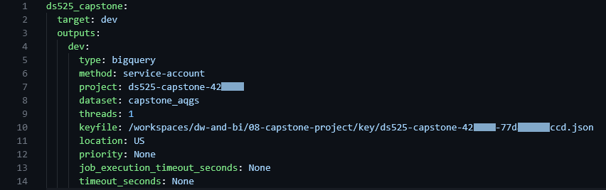

- ทดสอบการ connection กับ BigQuery โดย run คำสั่ง
```sh
dbt debug
```
- ถ้าทดสอบผ่านทั้งหมดจะแสดง All checks passed!

    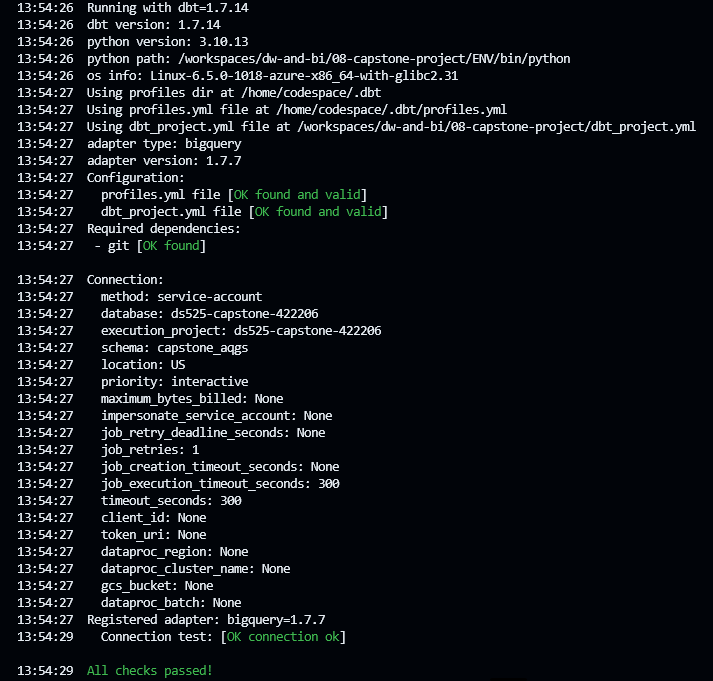

- สร้าง folder: staging และสร้าง file: _src.yml ใน folder และให้ใน file มีข้อมูลดังนี้ (เพื่อใช้อ้างอิง source data)

    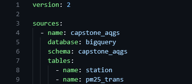

- ข้อมูลจาก source tables จะถูกนำมาใช้ในการสร้าง view ตามความต้องการ และเพื่อป้องกันการเปลี่ยนแปลงของ source table จาก user สามารถกำหนดการสร้าง view หรือ table ได้จาก file: dbt_project.yml ดังนี้

    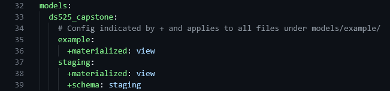

- การ transform source data ด้วยการใช้ dbt จะอ่านจาก file ที่มีนามสกุล .sql ที่อยู่ใน folder: models ทั้งหมด (หากมีหลาย folder ภายใต้ folder: models)

    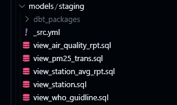

- script sql จาก file: view_station_avg_rpt.sql

    

- จากนั้น run คำสั่งด้านล่าง เพื่อเป็นการทดสอบและการสร้าง view
```sh
dbt run
dbt test
```

- จะได้ view บน dataset: capstone_aqgs_staging ตามรูปด้านล่าง

    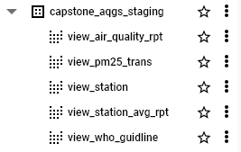

##

### 4. ใช้ view ที่สร้างขึ้นด้วย dbt ทำ visualzation ด้วย tableau 

- https://public.tableau.com/app/profile/nicharee.sribuchandee/viz/PM2_5DataAnalyticinThailand/Dashboard1?publish=yes

    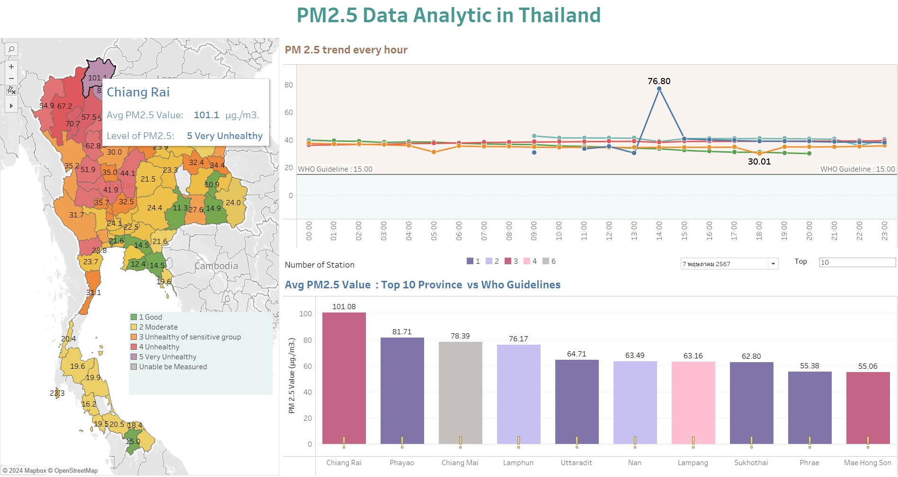

- top n จังหวัดที่มี avg PM2.5 สูงสุด
- สถานีใน top n จังหวัด ( ดูว่าเพียงพอต่อการเฝ้าระวังหรือไม่ )
- เช็คค่า PM2.5 กับมาตราฐานที่ WHO กำหนด โดยแสดงในเชิง icon สัญลักษณ์ฃ
